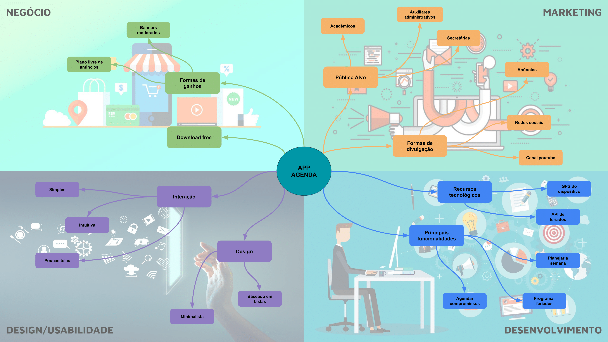
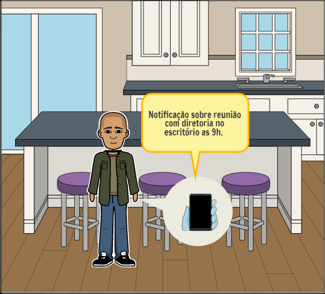
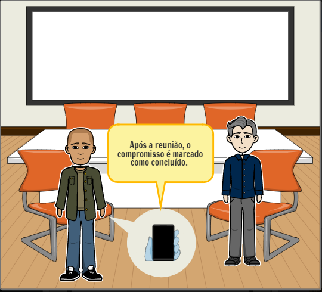
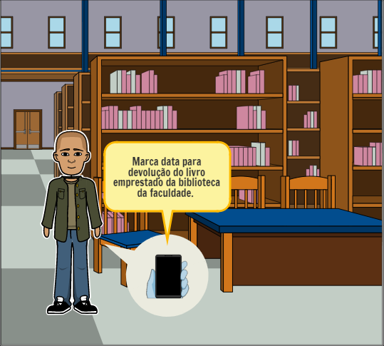
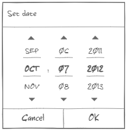
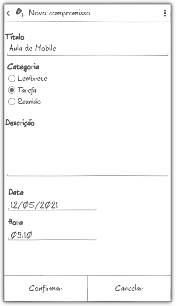
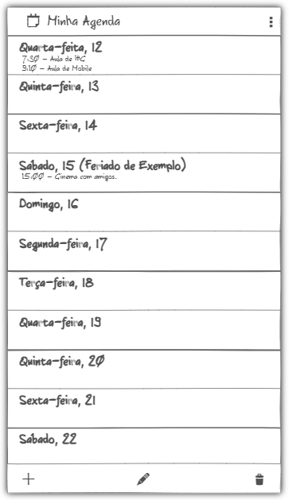
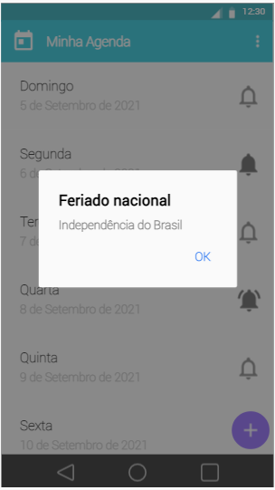
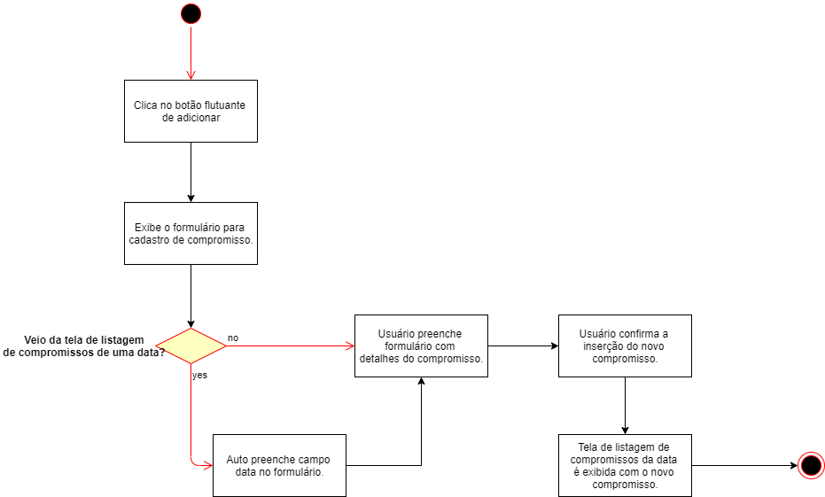
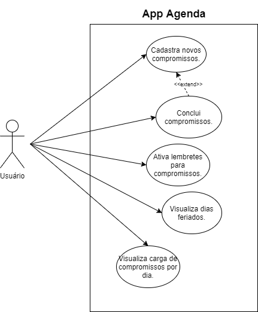

# App Agenda

Este aplicativo de agenda tem o objetivo de ser uma ferramenta prática, simples e intuitiva para o fácil manuseio no dia a dia. Com o AppAgenda é possível marcar seus compromissos com poucas interações, além de visualiza-los de forma rapida. O AppAgenda foi pensado como uma alternativa dinâmica para aplicativos de agenda.

O presente repositório tem por objetivo apresentar um descritivo da aplicação móvel idealizada pela equipe para o trabalho avaliativo requerido nas disciplinas **CPD031 - INTERFACE HUMANO - COMPUTADOR** e **CPD111 - CONCEPÇÃO E DESENVOLVIMENTO DE APLICAÇÕES PARA DISPOSITIVOS MÓVEIS**, ministradas no semestre letivo de 2021.1.

## Mapa conceitual

## Storyboard

## Protótipos de Baixa Fidelidade
|   |
| :------------: |
|  |
|  |
|  |
|  |
|  |
|  |

## Protótipos de Alta Fidelidade

Através do link que se segue é possível ter acesso interativo a todas as telas que serão descritas nos tópicos seguintes.

> [https://www.fluidui.com/editor/live/preview/cF9PVGlsZjZmSFNFeFh2TVJISzBvS3kzdFJpYTJraDBOZA==](https://www.fluidui.com/editor/live/preview/cF9PVGlsZjZmSFNFeFh2TVJISzBvS3kzdFJpYTJraDBOZA== "Fluid UI")

|   |
| :------------: |
|  |
|  |
|  |
|  |
|  |
|  |
|  |
|  |

## Diagrama de Atividade UML
|   |
| :------------: |
|  |

## Diagrama de Casos de Uso UML
|   |
| :------------: |
|  |

## Aplicações Correlatas
- [Estudo de aplicações correlatas](AplicaçõesCorrelatas/EstudoAplicaçõesCorrelatas.pdf)
- [Comparativo de aplicações correlatas](AplicaçõesCorrelatas/ComparativoAplicaçõesCorrelatas.pdf)
- [Relatório da aplicação](Relatorio/Relatório.pdf)

## Mobile - Resumo
|   |   |
| :-: | :-: |
| Interface em Material Design | **OK** |
| Internacionalização | **OK** |
| Permissão e Preferencias | **OK** |
| Google Analytic | **OK** |
| Comunicação com Servidor (Json) | **OK** |
| Persistência em SqlLite | **OK** |

## Equipe
- Luana Cruz Gomes
- Mateus Pena Machado de Jesus
